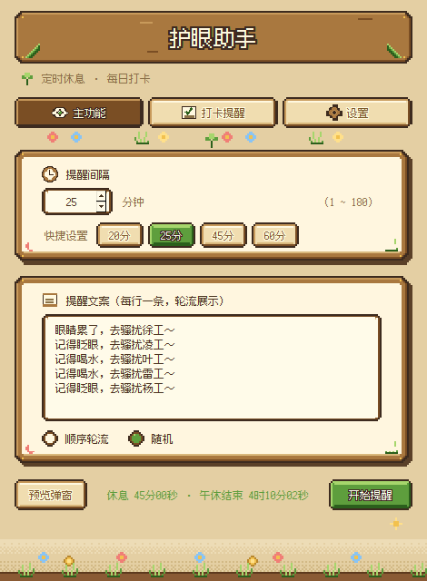
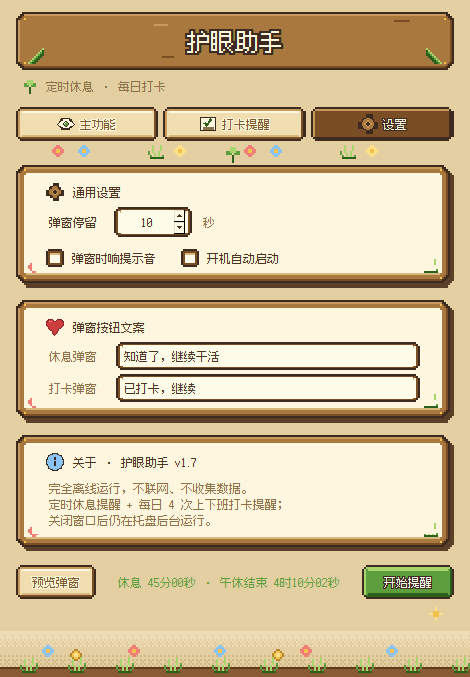
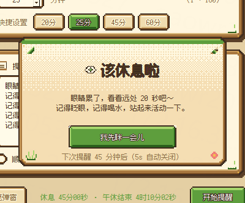
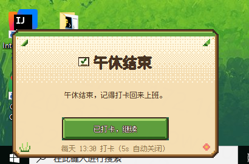
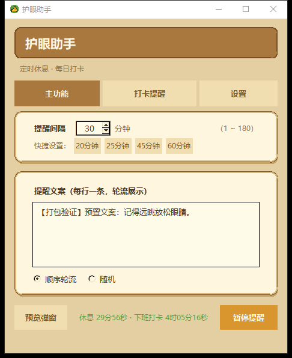

# 👁 护眼助手（Eye-Protect）


一款运行在 **Windows 10/11** 上的桌面小工具，帮助长时间面对电脑的办公人群 **定时休息眼睛**，并提供**每日上下班打卡提醒**。完全离线运行、不联网，绿色免安装。

界面采用 **星露谷像素风**（Stardew Valley style）—— 全部组件由程序化 2D 像素绘制，**零外部图片素材**，搭配开源像素字体 **Fusion Pixel 12px**（OFL 1.1，可商用）。

> 当前版本 **v1.9** ｜ 变更历史见 [CHANGELOG.md](CHANGELOG.md)

## ✨ 功能特性

| 功能 | 说明 |
|---|---|
| **定时休息提醒** | 按设定间隔（1 ~ 180 分钟，默认 45）循环在屏幕上弹出像素木牌提醒窗 |
| **稍后提醒** | 休息弹窗第二个按钮「稍后 N 分钟」（1 ~ 60，可调）；延后只生效一次，下次恢复正常间隔 |
| **多弹窗提醒** | 一次提醒可同时弹 1 ~ 6 个弹窗，铺在桌面**互不重叠**的不同位置；点其中任意一个即全部关闭 |
| **上下班打卡提醒** | 每日 4 次（上班 / 午休 / 午休结束 / 下班），可逐条开关、自定义时刻与提示词 |
| **提醒文案自定义** | 支持多行多段，顺序轮换或随机展示 |
| **按钮文字自定义** | 休息弹窗与打卡弹窗按钮文案各自独立设置 |
| **系统托盘常驻** | 右键菜单：打开设置 / 立即提醒 / 退出；关闭窗口不退出程序 |
| **不抢焦点** | 弹窗仅置顶展示，绝不调用 `focus_force`，不会打断你正在输入的光标 |
| **开机自启** | 可选，写 HKCU 注册表，不需要管理员权限 |
| **单实例运行** | 应用层握手 + 端口占用降级，重复启动只唤起已有实例 |
| **自适应分辨率 / DPI** | 弹窗落点按当前屏幕尺寸实时计算，兼容单 / 双屏切换 |
| **配置自动保存** | 存于 `%APPDATA%\EyeReminder\config.json`，不污染 exe 目录 |

## 🖥 界面一览

<table>
<tr>
<td align="center"><br><sub>主功能</sub></td>
<td align="center"><br><sub>打卡提醒</sub></td>
<td align="center"><br><sub>设置</sub></td>
</tr>
<tr>
<td align="center"><br><sub>休息提醒弹窗</sub></td>
<td align="center"><br><sub>打卡提醒弹窗</sub></td>
<td align="center"><br><sub>打包后运行</sub></td>
</tr>
</table>

更多截图（像素组件校对图 / 字号栅格对比 / PoC 稿）见 [`docs/preview/`](docs/preview/)，历史版本截图见 [`docs/preview/archive/`](docs/preview/archive/)。

## 📦 环境依赖

- Python 3.13+（**需带 tkinter 的系统 Python**）
- 运行依赖：`pystray`、`Pillow`
- 打包依赖：`pyinstaller`

```bash
pip install -r requirements.txt
```

## 🚀 运行

```bash
python src/main.py
```

## 🧱 打包

使用 `build.bat` 一键打包：

```bat
build.bat                :: 单文件版 -> dist\护眼助手.exe
build.bat --onedir       :: 目录版   -> dist\护眼助手\护眼助手.exe
build.bat --no-pause     :: 自动化调用，结束不暂停
```

| 版本 | 产物 | 启动速度 | 适用场景 |
|---|---|---|---|
| 单文件版 | `dist\护眼助手.exe` | 约 25 秒（每次启动先自解压） | 拷贝分发，一个文件搞定 |
| 目录版 | `dist\护眼助手\护眼助手.exe` | 约 2 秒 | 自己长期使用；**必须整个文件夹一起拷走** |

> **注意**：必须使用带 tkinter 的解释器（如 `C:\Program Files\Python314\python.exe`）。
> 部分托管 / 嵌入式 Python 不含 tkinter，用它打出的 exe 启动即崩 —— `build.bat` 会做依赖自检并提示。
>
> `build.bat` 刻意以 **GBK/CP936** 编码保存并显式 `chcp 936`，请勿改为 UTF-8 或用工具重写换行
> （见 `.gitattributes` 中的说明）。

## 🧪 自测

`scripts/` 下是开发辅助脚本，均以源码方式直接运行：

```bash
python scripts/smoke_test.py     # 冒烟测试：配置读写/损坏回退、调度器、文本清洗、单实例降级、GUI 启动
python scripts/e2e_test.py       # 端到端：真实触发休息 + 打卡弹窗，校验居中与配色
python scripts/visual_check.py   # 界面截图核对（输出到 scripts/out/）
python scripts/font_check.py     # 像素字体可用性自检
python scripts/make_icon.py      # 生成 assets/icon.ico（打包前置步骤）
python scripts/pixel_poc.py      # 像素风控件原型（设计稿生成）
```

静态检查（需 `pip install -r requirements-dev.txt`）：

```bash
pyflakes src scripts
```

## 📁 项目结构

```
Eye-Protect/
├── docs/
│   ├── 需求文档.md        # 功能需求 / 技术方案 / 验收标准
│   ├── 构建Prompt.md      # 可执行的构建指令
│   ├── 本次修改说明.md    # v1.7 → v1.9 变更明细
│   ├── 优化点.txt         # 后续可做的功能与优化清单
│   └── preview/           # 界面效果截图
│       └── archive/       # 历史版本截图（已被当前版本取代）
├── src/
│   ├── main.py            # 入口：DPI 感知、单实例握手检测、启动
│   ├── app.py             # 应用主控制器（配置/调度/窗口/弹窗/托盘 串联）
│   ├── config.py          # 配置读写（JSON，原子写 + 严格类型校验）
│   ├── scheduler.py       # 定时调度器（后台线程：休息提醒 + 每日打卡）
│   ├── settings_window.py # 设置主窗口（三标签页 + 像素绘制层）
│   ├── popup.py           # 屏幕提醒弹窗（休息/打卡；像素木牌；多弹窗落点）
│   ├── pixelart.py        # 像素绘制引擎（全组件唯一绘制出口，零图片素材）
│   ├── theme.py           # 调色板（星露谷像素风，window / popup 两组色键）
│   ├── fonts.py           # 像素字体加载（进程内私有注册，缺失自动回落）
│   ├── tray.py            # 系统托盘
│   └── icons.py           # 程序内图标（像素眼睛）
├── assets/
│   ├── icon.ico           # 打包用应用图标（scripts/make_icon.py 生成，不入库）
│   └── fonts/             # 像素字体 —— 唯一随包分发的文件资源
├── scripts/               # 开发辅助（图标生成 / 各项自测 / 原型）
├── requirements.txt       # 运行 + 打包依赖
├── requirements-dev.txt   # 开发/静态检查依赖
├── build.bat              # 一键打包脚本
├── CHANGELOG.md           # 版本变更记录
├── LICENSE                # MIT
└── .gitattributes         # 换行与二进制判定
```

## 📄 文档

- [需求文档](docs/需求文档.md) —— 完整功能需求、技术方案与验收标准
- [构建指令](docs/构建Prompt.md) —— 从零复现本项目的构建 Prompt
- [变更记录](CHANGELOG.md) —— v1.1 ~ v1.9 全部变更

## 📜 许可

- 本项目代码采用 [MIT License](LICENSE)。
- 随包分发的像素字体 **Fusion Pixel 12px** 采用 [SIL Open Font License 1.1](assets/fonts/OFL.txt)，可商用；该字体不属于 MIT 授权范围，使用请遵循 OFL 1.1。
